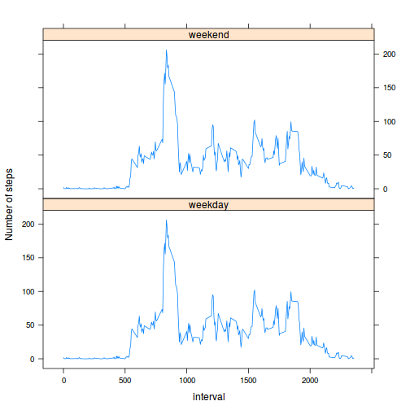

Assigment 1
===========
The goal is to write a report that answer some questions detailed below.

## Loading the data


```r
data <- read.csv("activity.csv")
str(data)
```

```
## 'data.frame':	17568 obs. of  3 variables:
##  $ steps   : int  NA NA NA NA NA NA NA NA NA NA ...
##  $ date    : Factor w/ 61 levels "2012-10-01","2012-10-02",..: 1 1 1 1 1 1 1 1 1 1 ...
##  $ interval: int  0 5 10 15 20 25 30 35 40 45 ...
```

```r
total.steps.perday <- tapply(data$steps,data$date,sum,na.rm=T)
```

## What is the mean total number of steps taken per day?

1. Make an histogram of the total number of steps taken each day

```r
hist(total.steps.perday)
```

 

2. Calculate and report the *mean* and *median* total number of steps taken per day

```r
mean.total.steps.perday <-  mean(total.steps.perday)
median.total.steps.perday <- median(total.steps.perday)
```

The mean total steps per day is 9354.2295 and the median 
equals 10395.


## What is the average daily activity pattern?

1. Make a time series plot of the 5-minute interval (x-axis) and the average 
number of steps taken, averagesd across all days (y-axis)


```r
q2 <- tapply(data$steps,data$interval,mean,na.rm=T)
plot(x =as.numeric(names(q2)), y = q2, type="l", las=2, cex=0.6,
     main= "average number of steps taken across all days",
     xlab="5-minutes intervals", ylab="average number of steps")
```

 

2. Which 5-minute interval, on average across all the days in the dataset, 
contains the maximum number of steps? The answer is the interval 
835.


## Imputing Missing values

1. Calculate and report the total number of missing values in the dataset: There 
are a total of 2304 missing values.

2. Devise a strategy for filling in all of the missing values in the dataset.

The strategy I propouse is to use the mean of the respective interval for each 
missing row. I choose to use the intervals since there are days were all the 
observations are missing, so there is no mean for those day. The following code 
does the imputations:


```r
steps2 <- data$steps #generate an imputed column
cases <- which(is.na(data$steps)) #identify which cases are missing values
means.intervals <- tapply(data$steps,data$interval,mean,na.rm=T)
steps2[cases] <- means.intervals[match(data$interval[cases], as.numeric(names(means.intervals)))] #impute
```

3. Create a new dataset that is equal to the original dataset but with the missing data filled in

```r
data2 <- data
data2$steps <- steps2
str(data2)
```

```
## 'data.frame':	17568 obs. of  3 variables:
##  $ steps   : num  1.717 0.3396 0.1321 0.1509 0.0755 ...
##  $ date    : Factor w/ 61 levels "2012-10-01","2012-10-02",..: 1 1 1 1 1 1 1 1 1 1 ...
##  $ interval: int  0 5 10 15 20 25 30 35 40 45 ...
```


4. Make a histogram of the total number of steps taken each day and calculate 
and report the *mean* and *median* total number of steps taken per day.


```r
total.steps.perday2 <- tapply(data2$steps,data2$date,sum,na.rm=T)
hist(total.steps.perday2)
```

 

```r
mean.total.steps.perday2 <-  mean(total.steps.perday2)
median.total.steps.perday2 <- median(total.steps.perday2)
```

The mean total steps per day for the imputed dataset is 1.0766 &times; 10<sup>4</sup> and the median 
equals 1.0766 &times; 10<sup>4</sup>. Mean and median coincide in this ocassion, meaning that the distribution of the number of steps became symetric.
The difference between the imputed and not imputed datasets are  1411.9592 for the mean and 371.1887 for the median.

## Are there differences in activity patterns between weekdays and weekends?

1. Create a new factor variable in the dataset with two levels -- "weekday" and "weekend" indicating whether a given date is a weekay or weekend day.

```r
data2$typeday <- rep("weekday",length(data2$date))
NANANA
```

```
## [1] NA
```

```r
table(data2$typeday)
```

```
## 
## weekday 
##   17568
```

2. Make a planel plot containing a time series plot

```r
library(lattice)
q3 <- as.data.frame(tapply(data2$steps,list(data2$interval,data2$typeday),mean))
#create a data structure for using lattice
q3 <- data.frame(interval = rep(as.numeric(rownames(q3)),2), 
                 meansteps = c(q3$weekday,q3$weekend), 
                 daytype = c(rep("weekday",dim(q3)[1]),
                             rep("weekend",dim(q3)[1])))
xyplot(meansteps ~ interval | daytype, data=q3, type="l",layout=c(1,2),ylab="Number of steps")
```

 


